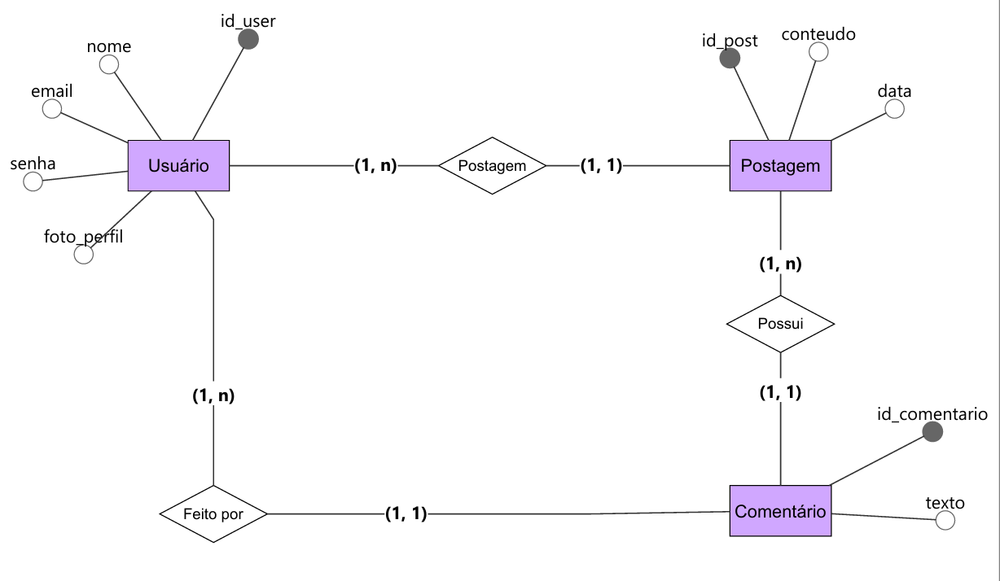

## Projeto de Banco de Dados
**Nome do Projeto** Sistema de postagem e comentários.

**Equipe de Desenvolvimento** Manu, Camila, Maria e Luiza

## 1. Visão Geral do Sistema (Escopo)
O **Sistema de Postagens e Comentários** foi projetado para permitir que usuários publiquem conteúdos, interajam por meio de comentários e reações, e construam uma comunidade engajada.

## 2. Regras de Negócios (RN)
**RN01**: O sistema deve gerenciar o cadastro e perfil dos usuários ativos, garantindo o registro de suas informações fundamentais:

- Nome do usuario 
- E-mail
- Senha
- Foto de perfil

**RN02**: O sistema deve permitir que usuários interajam em publicações existentes através do envio de comentários, contendo:

- Texto do comentário
- Identificação do post vinculado
- Identificação do comentário

**RN03**: O sistema deve aplicar regras na remoção de dados: ao excluir uma postagem, todos os comentários e reações associados a ela devem ser removidos automaticamente.

## Modelagem Conceitual
